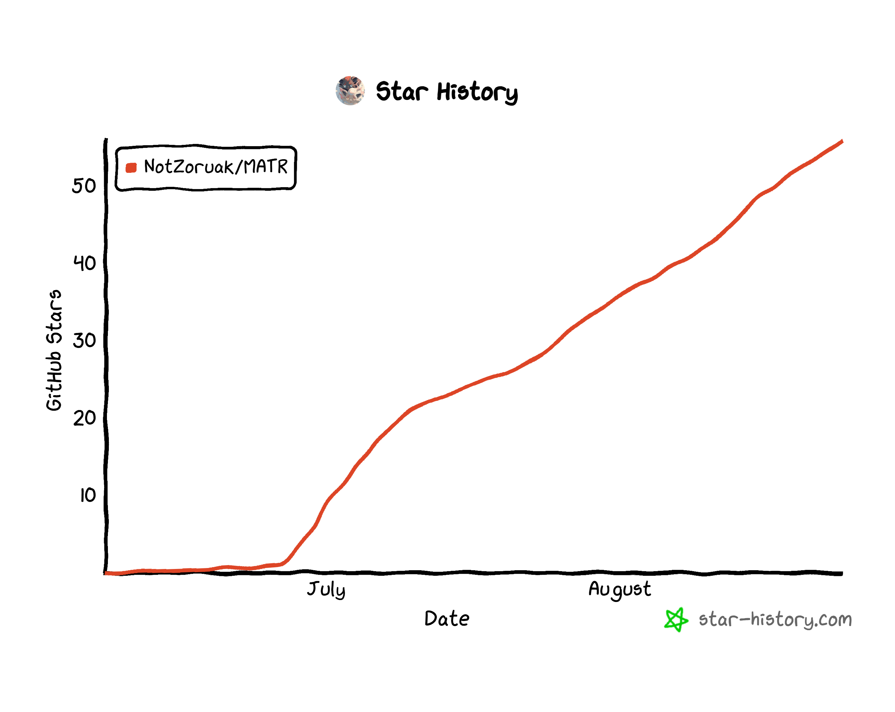

<!-- markdownlint-disable -->

<div align="center">


# MATR — 刀剑乱舞自动化助手

<br>
<p align="center">
    
    
    
    <a href="https://github.com/MaaXYZ/MaaFramework" target="_blank"></a>
    <br/>
    
    
</p>
<br>

<!-- markdownlint-restore -->

MATR 是一个基于 MaaFramework 的《刀剑乱舞》PC 端长期自动化系统，通过 ADB 连接模拟器运行游戏。项目以状态识别、任务编排、异常恢复、同步后勤和运行结果分析为核心，面向长时间、低干预的自动化运行。推荐使用 MuMu 模拟器 12，分辨率 1280×720；其他支持 ADB 的模拟器及分辨率亦可运行。

</div>

> [!TIP]
>
> 本项目目前处于快速迭代更新阶段，欢迎提交 PR 和 Issue。无论是使用中遇到的问题、功能建议，还是其他想法，都欢迎提出。
> 遇到问题请先前往 [Issues 页面](https://github.com/NotZoruak/MATR/issues) 搜索已有解答，或通过下方反馈渠道提交。

## ⚠️ 免责声明与风险提示

> [!NOTE]
>
> 本项目基于 [MaaFramework](https://github.com/MaaXYZ/MaaFramework)（LGPL v3）构建，采用 [GNU General Public License v3.0](LICENSE) 协议，**永久免费且开源**。
> - 本项目为非计算机专业人员心血来潮之作，大量依赖 vibe coding 完成，仅供学习交流使用。
> - 程序图标（含 `assets/resource/logo/` 等图标资源）不随项目开源，著作权归 [米酒气泡水](https://huajia.163.com/main/profile/wEayJn7E) 所有，商用权归开发者所有。
>
> 本软件为第三方工具，通过识别游戏画面模拟常规交互动作，简化《刀剑乱舞-ONLINE-》的重复性操作。本项目遵循相关法律法规，绝不会修改任何游戏文件或数据。
>
> 因使用本软件而产生的任何问题，均与本项目及开发者无关。
> - 请勿在任何平台的《刀剑乱舞-ONLINE-》官方账号下提及 MATR。

> [!CAUTION]
>
> 根据游族网络《刀剑乱舞-ONLINE-》用户许可协议，严禁使用任何形式的妨碍游戏公平性辅助工具或程序（外挂）。官方已多次对违规账号采取封禁措施，包括但不限于封号警告、永久封禁等处罚。
>
> **您应充分了解并自愿承担使用本工具可能带来的所有风险，包括账号封禁、数据丢失等。**

## 快速开始

### 1. 下载

前往 [Releases](https://github.com/NotZoruak/MATR/releases) 页面，在最新版本下方点击「Assets」展开文件列表，下载命名为 `MATR-vx.x.x.zip` 的文件，解压到空目录。

> 已安装的用户可通过软件内设置面板检查更新，支持 GitHub 和 [Mirror酱](https://mirrorchyan.com) 双下载源切换（Mirror酱 需购买 CDK 激活）。
>
> 注意：Release 基于 x86_64 架构，Windows 系统。Arm 架构（如苹果 M 系列芯片、树莓派等）、Mac 系统、Linux 系统暂不支持。

### 2. 启动

双击 `matr.exe` 即可运行。首次启动耗时可能较长，请耐心等待。

> 启动时若弹出 ".NET Desktop Runtime 10.0" 或 "VCRUNTIME140.dll" 等系统错误提示，说明缺少运行依赖。右键 `DependencySetup_依赖库安装_win.bat` → **以管理员身份运行**，安装完成后重新启动 MATR。

## 核心能力

### 状态机驱动

基于有限状态机组织自动化流程，通过识别当前游戏状态进行状态转换。任务可以从中途接管，在异常处理完成后回到可继续执行的状态，而不必始终从流程起点重新开始。

### 任务编排

通过任务编排将出阵、回城、补充刀装、队伍切换、远征处理和结果记录等操作组合为完整流程。不同任务可以复用通用处理逻辑，并根据任务选项调整执行路径。

### 异常恢复

持续处理任务执行过程中可能出现的异常状态，包括意外弹窗、卡死、游戏进程异常和模拟器重启。启用相关设置后，MATR 可以重新启动模拟器实例与游戏进程，并在恢复后继续执行任务。

### 同步后勤

同步后勤用于协调出阵任务与远征任务。当地下城等流程不会自动返回本丸时，系统仍可根据远征状态主动插入返回本丸收取奖励、重新派遣等后勤处理，减少长期运行中的远征资源损失。

### 事件日志与运行结果分析

工作记录工具可读取日志文件，按任务拆分并过滤可统计的数据，展示任务运行时间、运行状态、出阵次数、行军次数、完成圈数和返回本丸次数，并汇总资源获得与刀剑掉落。记录支持在任务运行期间刷新查看，任务结束后也可以手动保存，或将多条记录合并统计。

## 支持的任务与活动


### 任务

- **后勤**：统一处理远征、修刀和内番，可通过其他任务中的同步后勤选项，在出阵中穿插后勤处理。启用全局设置中的远征智能调度后，可定时从活动页面主动返回本丸检查队伍状态。启用长期远征计划后，可在远征队伍中刀剑男士疲劳值低于阈值时，自动刷花并恢复编队，再次派遣远征。
- **合战场**：选择时代、地域、部队和阵形进行长期出阵，支持重伤、刀装、疲劳、撤退和同步后勤处理。
- **地下城**：选择目标层数和部队进行出阵，支持重伤、刀装、疲劳、每轮回本丸、动画跳过和同步后勤。
- **战术强化训练**：选择部队和难度进行活动出阵，支持换队长、门票不足时停止和同步后勤。
- **联队战**：选择部队和难度进行活动出阵，支持部队交替、换队长和门票处理。
- **刷花**：选择部队单骑出阵 1-1，提升刀剑男士的疲劳度。
- **刀解**：按刀种筛选刀剑并自动解体，同时处理邮箱。
- **习合**：按刀种筛选刀剑进行习合，支持搓糖功能，自动跳过乱7以上刀剑（不对上锁刀剑生效）。

### 小工具

- **本丸**：包含仓库、工作记录和刀帐三个页面。仓库用于识别和保存本丸资源与道具数量，并可生成核心资源变化折线图；工作记录用于查看任务运行过程中的收获与特殊状况；刀帐用于统计立绘拥有信息。仓库与刀帐支持自动识别。
- **限锻计算工具**：根据锻刀公式、当前积分、资源和道具数量，计算达到目标积分所需的锻刀次数及剩余资源，支持自动读取当前积分和资源。
- **数据库**：包含极化经验表、远征收益表和剪影识别。剪影识别可按置信度同时给出并排列多条结果，同时显示对应剪影完整图片。

## QQ频道

频道号 `pd68335487`，用于日常交流、使用咨询和经验分享。Bug 反馈请优先通过下方问卷或 GitHub Issues 提交。

## 反馈与建议

MATR 自带日志打包功能：在任务页面的“日志”卡片右上角点击文件夹图标，选择需要的日志和截图后点击“导出日志”。打包完成后，请将压缩包通过 [问题反馈与日志收集问卷](https://ycnviwngeokc.feishu.cn/share/base/form/shrcnEJvA6mbBOSU2RO7DnRm8Qh) 或 [GitHub Issues](https://github.com/NotZoruak/MATR/issues) 提交。

遇到 bug 或有功能建议？欢迎通过以下方式反馈：

提交反馈时请尽量包含以下信息：

- **Bug 报告**：描述操作步骤、预期结果和实际结果，附上截图或日志（`debug/` 目录下）
- **功能建议**：描述期望的功能场景和使用目的

> 提交前请先搜索已有 issue，避免重复。

## 目录结构

```
MATR/
├── matr.exe                              ← 桌面启动入口
├── appsettings.json                      ← 应用配置
├── assets/
│   ├── interface.json                    ← 任务与选项配置
│   └── resource/
│       ├── base/
│       │   ├── pipeline/                 ← 自动化任务流水线（JSON）
│       │   │   ├── Sortie.json           ← 合战场
│       │   │   ├── Underground.json      ← 地下城
│       │   │   ├── Expedition.json       ← 远征
│       │   │   ├── LRentaisen.json       ← 陆联（联队战）
│       │   │   ├── TacticalTraining.json ← 战术强化训练
│       │   │   ├── FlowerBrush.json      ← 刷花
│       │   │   ├── Disassemble.json      ← 刀解
│       │   │   ├── Mix.json              ← 习合
│       │   │   └── GoHome.json           ← 回到本丸
│       │   ├── image/                    ← 模板匹配图片
│       │   ├── custom/                   ← 自定义动作脚本
│       │   └── model/ocr/                ← OCR 模型
│       ├── logo/                         ← 程序图标
│       ├── silhouette/                   ← 剪影识别样板
│       └── announcement/                 ← 公告
├── _src/                                 ← C# 源代码
├── docs/                                 ← 项目文档
├── tools/                                ← 构建/发布脚本
├── screenshots/                           ← README 展示图片
├── runtimes/                             ← .NET 运行时库
├── .github/                              ← CI/CD workflows
│   └── workflows/
│       ├── mirrorchyan_release.yml       ← 发布时上传 Mirror酱
│       └── check.yml                     ← PR 检查
└── LICENSE
```

## 致谢

### 开源项目

- [MaaFramework](https://github.com/MaaXYZ/MaaFramework) — 基于图像识别的自动化黑盒测试框架
- [MFAAvalonia](https://github.com/SweetSmellFox/MFAAvalonia) — 基于 Avalonia UI 的 MaaFramework 通用 GUI 解决方案
- [Mirror酱](https://mirrorchyan.com) — 软件分发与 CDK 激活管理平台
- [MaaAssistantArknights](https://github.com/MaaAssistantArknights/MaaAssistantArknights) — 《明日方舟》小助手，全日常一键长草
- [MFAToolsPlus](https://github.com/SweetSmellFox/MFAToolsPlus) — MaaFramework 新一代开发辅助工具箱
- [MaaLogAnalyzer](https://github.com/MaaXYZ/MaaLogAnalyzer) — 可视化日志分析工具，告别手翻百万行日志

### 开发者

感谢以下开发者对 MATR 的贡献：

[](https://github.com/NotZoruak/MATR/graphs/contributors)

## Star History

如果觉得软件对你有帮助，帮忙点个 Star 吧！（网页最上方右上角的小星星），这就是对我们最大的支持了！

<a href="https://star-history.com/#NotZoruak/MATR&Date">
  
</a>
