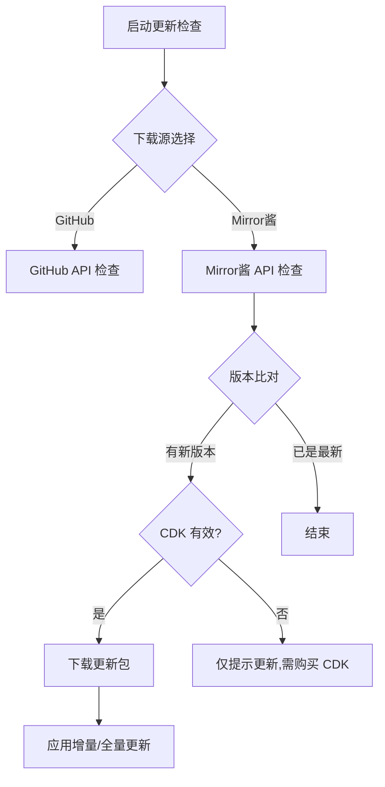

# Mirror酱 集成文档

## 概述

[Mirror酱](https://mirrorchyan.com) 是一个软件分发与 CDK 激活管理平台，提供：

- 版本更新检查 API（6000+ 阿里云/腾讯云 CDN 节点）
- CDK 激活码验证与下载次数管控
- 增量更新包的生成与分发（基于 `changes.json`）
- 日活统计、来源统计等运营数据

集成开发 QQ 群：1026040805 | 用户售后 QQ 群：995458883

---

## 当前集成状态

MATR 已完整接入 Mirror酱 API，支持 GitHub / Mirror 双下载源切换。

### 核心代码位置

| 文件 | 说明 |
|---|---|
| `_src/MFAAvalonia/Helper/VersionChecker.cs` | 更新检查主逻辑（约 4000 行），包含 Mirror酱 API 调用 |
| `_src/MFAAvalonia/Helper/MFAUrls.cs` | Mirror酱 购买链接常量 |
| `_src/MFAAvalonia/Views/UserControls/Settings/VersionUpdateSettingsUserControl.axaml` | 更新设置 UI（CDK 输入、下载源切换等） |
| `_src/MFAAvalonia/ViewModels/UsersControls/Settings/VersionUpdateSettingsUserControlModel.cs` | 更新设置 ViewModel（CDK 状态管理） |

### 已接入能力一览



---

## API 调用详情

### 请求格式

```
GET https://mirrorchyan.com/api/resources/{resId}/latest?channel={channel}&current_version={version}&cdk={cdk}&os={os}&arch={arch}&user_agent={userAgent}
```

### 参数说明

| 参数 | 来源 | 说明 |
|---|---|---|
| `resId` | `MaaProcessor.Interface?.RID` | 资源标识符，由 Mirror酱 分配 |
| `channel` | 设置页的更新通道选择 | alpha / beta / stable |
| `current_version` | `RootViewModel.Version`（当前硬编码 `v2.13.0`） | 本地版本号 |
| `cdk` | 设置页 CDK 输入框 → `SimpleEncryptionHelper` 加密存储 | 用户激活密钥 |
| `os` | `RuntimeInformation` 运行时检测 | win / linux / macos |
| `arch` | `RuntimeInformation` 运行时检测 | x86_64 / arm64 |
| `user_agent` | 固定 `"MFA"`，对应统计面板中的签到源 | 来源标识 |

### 响应处理

核心方法：`VersionChecker.GetDownloadUrlFromMirror()`（L2601）

成功时解析字段：

- `version_name` → 最新版本号
- `url` → 带时效的下载地址
- `sha256` → 文件校验值
- `update_type` → `"full"` 为全量，其他为增量
- `cdk_expired_time` → CDK 到期时间戳（存入 `CdkExpiredTime`）
- `release_note` → 版本日志

错误码处理：`HandleBusinessError()`（L2739），覆盖全部文档定义的错误码。

---

## CDK 管理体系

### 存储

CDK 通过 `SimpleEncryptionHelper` 加密后存入本地配置，配置键为 `DownloadCDK`。

代码中读取时使用 `CDK()` 方法（L3486），避免明文出现在日志和配置文件中。

### UI 展示

设置页面选择 Mirror酱 作为下载源后，自动显示 CDK 输入区域：

- 密码输入框（Masked）
- "购买链接" 按钮 → `https://mirrorchyan.com?rid=MFAAvalonia&source=mfaa-software`
- CDK 到期倒计时显示，颜色状态指示：
  - 绿色：有效期充裕
  - 橙色：临近到期
  - 红色：已过期
- "查询剩余时间" 按钮（CDK 为空时显示）

### 启动时检查

应用启动后 `AddCDKCheckTask()`（L225）向任务管理器注册 CDK 到期时间查询任务。

---

## 来源统计

为辅助运营数据分析，已配置两类来源追踪：

| 类型 | 参数 | 值 | 用途 |
|---|---|---|---|
| 签到源 | API 请求 `user_agent` | `MFA` | 统计用户从何处使用 CDK |
| 付费源 | 购买链接 `source` | `mfaa-software` | 统计用户从何处进入购买页 |

---

## 增量更新机制

### changes.json 结构

Mirror酱 为增量包提供版本间差异描述：

```json
{
  "added": ["foo/a.png"],
  "modified": ["resource/config.json"],
  "deleted": ["bar/c.png"],
  "added_dir": ["foo"],
  "deleted_dir": ["bar"]
}
```

### 处理流程

1. `ApplyIncrementalDeletions()`（L931）解析 `MirrorChangesJson`
2. 按 `deleted` 和 `deleted_dir` 列表删除旧文件/目录
3. 解压新文件覆盖

全量更新时跳过此步骤，直接解压覆盖。

---

## 接入新项目的流程

如果要将一个新的项目接入 Mirror酱，需要以下步骤：

### 1. 联系 Mirror酱 获取 res_id

加入集成开发 QQ 群 **1026040805**，提供项目信息申请资源标识符。

### 2. 客户端代码接入

参照 `VersionChecker.GetDownloadUrlFromMirror()` 实现：

1. 构造 API 请求 URL（含 `resId`、`current_version`、`cdk`、`os`、`arch`、`user_agent` 参数）
2. 解析响应 JSON（`code`、`data.version_name`、`data.url`、`data.sha256`、`data.update_type`）
3. 实现错误码处理（参照 Mirror酱 [错误代码表](https://github.com/MiraiChyan/docs/blob/main/ErrorCode.md)）
4. 实现增量更新逻辑（解析 `changes.json`，先删后覆盖）
5. 实现 SHA256 校验

### 3. UI 接入

- 添加 CDK 输入框
- 添加 Mirror酱 购买链接（含 `source` 参数做付费源统计）
- 显示 CDK 到期时间

### 4. CI/CD 自动上传（可选）

联系 Mirror酱 定制自动化上传方案，在每次版本发布时自动推送更新包。

---

## 待办事项

- [ ] **联系 Mirror酱 确认 `res_id` 已注册**（当前通过 `MaaProcessor.Interface?.RID` 动态获取）
- [ ] **CI/CD 自动上传**：联系 Mirror酱 配置发布时自动推送更新包
- [x] **版本号动态化**：`RootViewModel.Version` 当前硬编码 `v2.13.0`，MFAA 程序本体更新频率低，保持硬编码即可
- [ ] **CDK 购买引导页优化**：当 CDK 为空或过期且 Mirror酱 检测到新版本时，考虑弹窗引导用户购买/续费
