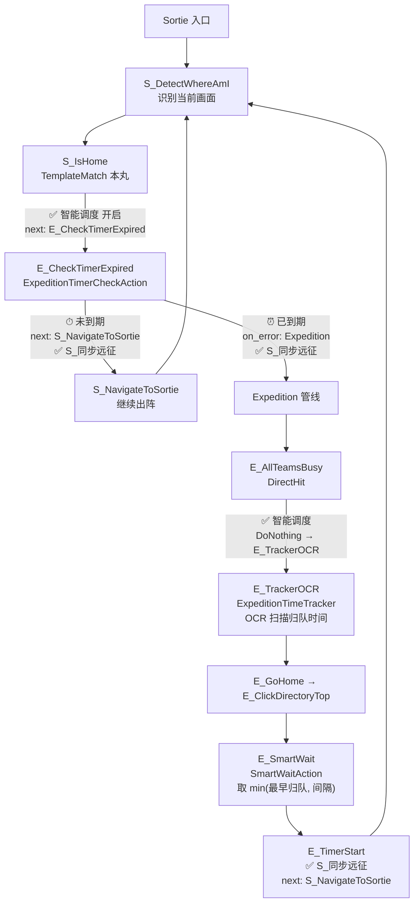
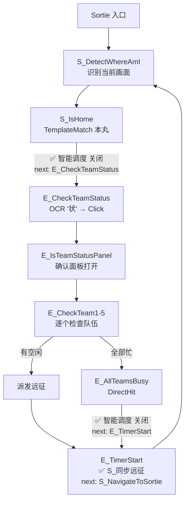
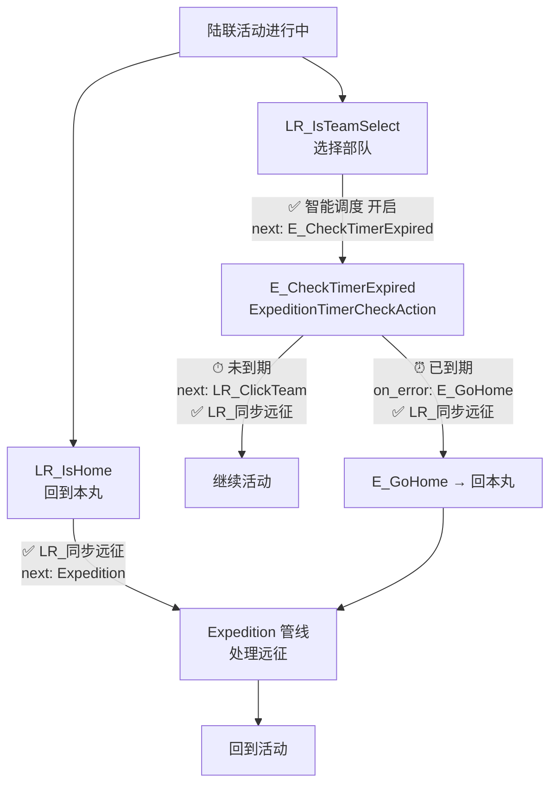
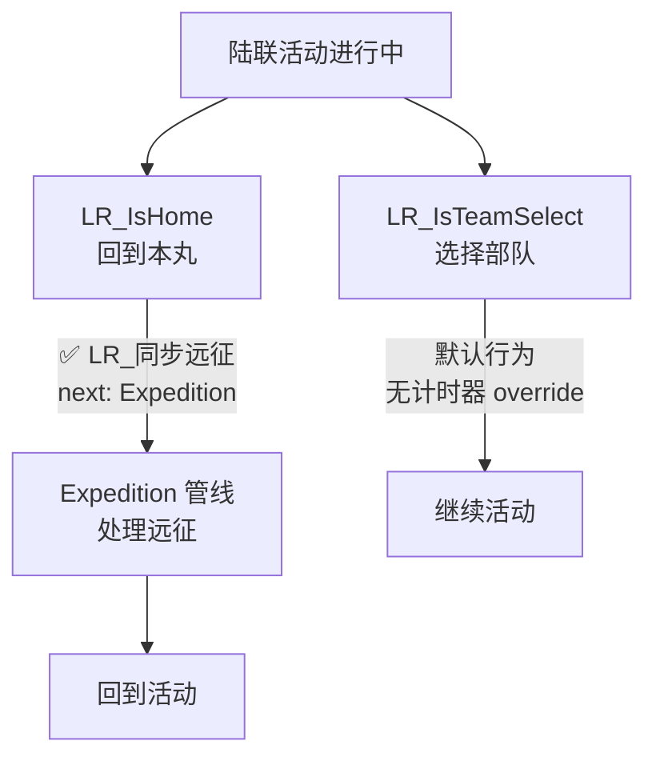

# 远征智能调度 v2 — 流程图验证

## 合战场 + 同步远征

### 智能调度 开启

### 智能调度 关闭

## 陆联 + 同步远征

### 智能调度 开启

### 智能调度 关闭

## 节点归属

| 节点 | 设置来源 |
|------|---------|
| S_IsHome.next | 智能调度（开启→E_CheckTimerExpired，关闭→E_CheckTeamStatus） |
| E_CheckTimerExpired.next/on_error | S_同步远征（next→S_NavigateToSortie, on_error→Expedition） |
| E_TimerStart.next | S_同步远征 / LR_同步远征（任务特定） |
| E_AllTeamsBusy.next | 智能调度（开启→E_TrackerOCR，关闭→E_TimerStart） |
| LR_IsTeamSelect.next | 智能调度（仅开启→E_CheckTimerExpired） |
| LR_IsHome.next | LR_同步远征（→Expedition） |
